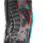
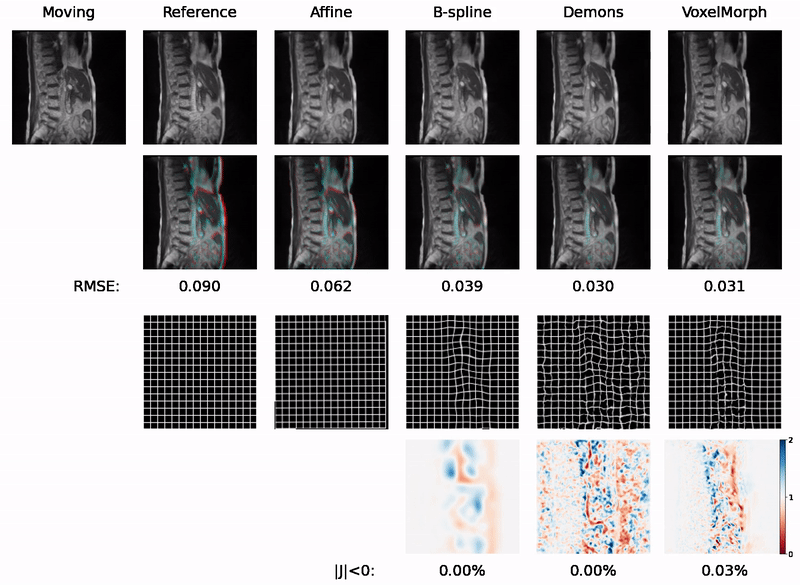

DeepBreath: Fast Deformable Registration for Real-time MRI-guided Radiation Therapy 
===========
"Fast deformable image registration for real-time target tracking during radiotherapy using cine MRI and deep learning."
*Under Review*

## Issues
- Please report any issues on the public forum.

## License
© [Optics in Medicine Lab](https://sites.dartmouth.edu/optmed/) - This code is made available under the GPLv3 License and is available for non-commercial academic purposes. 
